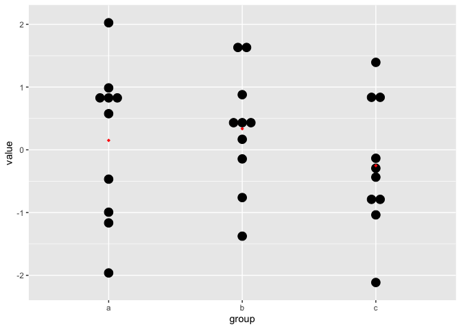
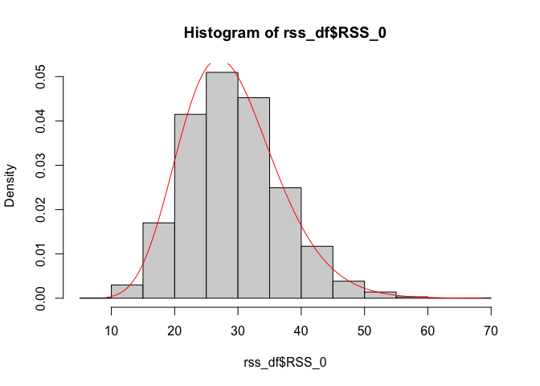
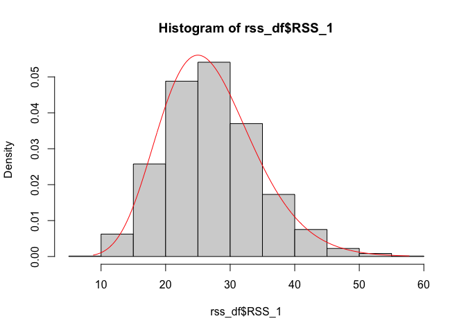
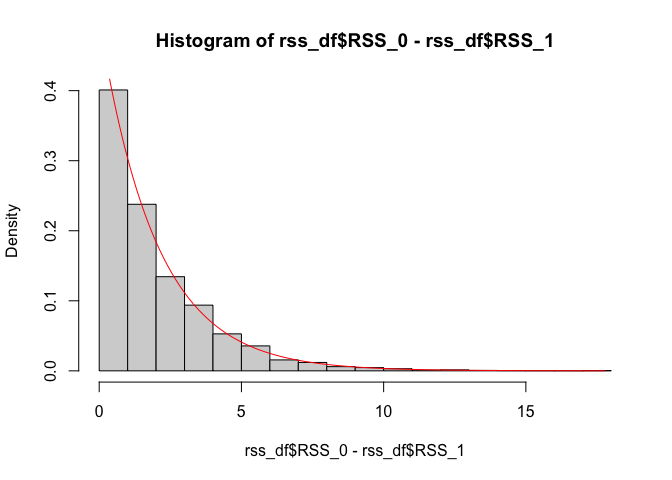
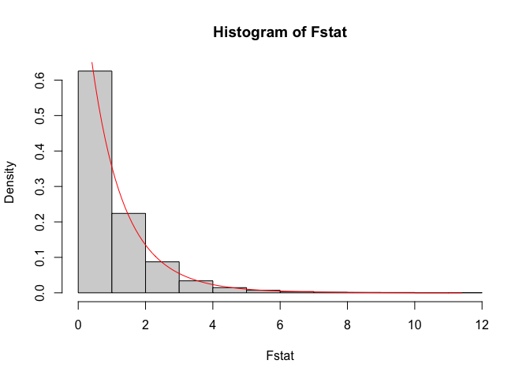

Simulating *F*-statistics
================

``` r
library(tidyverse)
```

    ## ── Attaching packages ───────────────────────────────── tidyverse 1.3.0 ──

    ## ✓ ggplot2 3.3.2     ✓ purrr   0.3.4
    ## ✓ tibble  3.0.1     ✓ dplyr   1.0.0
    ## ✓ tidyr   1.1.0     ✓ stringr 1.4.0
    ## ✓ readr   1.3.1     ✓ forcats 0.5.0

    ## ── Conflicts ──────────────────────────────────── tidyverse_conflicts() ──
    ## x dplyr::filter() masks stats::filter()
    ## x dplyr::lag()    masks stats::lag()

Let’s create 5000 data points from a multi-group comparison with no
difference in group means

``` r
n_data <- 5000
n_per_group <- 10
n_groups <- 3
overall_mean <- 0
overal_sd <- 1
```

``` r
set.seed(1)
sim_df <- bind_rows(lapply(seq_len(5000), function(x){
  tibble(
    id = x,
    value = rnorm(n = n_per_group * n_groups, 
                  mean = overall_mean,
                  sd = overal_sd),
    group = rep(letters[seq_len(n_groups)], each = 10)
  )
}))
```

As an example we will inspect one of the instances:

``` r
filter(sim_df, id == 20) %>% 
  ggplot(aes(x = group, y = value)) +
  geom_dotplot(binaxis='y', stackdir='center') +
  stat_summary(fun=mean, geom="point", 
               shape=18, color="red")
```

    ## `stat_bindot()` using `bins = 30`. Pick better value with `binwidth`.

<!-- -->

Now we will compute, both the group mean and the overall mean for each
instance (unique id):

``` r
sim_df <- sim_df %>% 
  group_by(id) %>% 
  mutate(obs_overall_mean = mean(value)) %>% 
  group_by(id, group) %>% 
  mutate(obs_group_mean = mean(value)) %>% 
  ungroup()

sim_df
```

    ## # A tibble: 150,000 x 5
    ##       id  value group obs_overall_mean obs_group_mean
    ##    <int>  <dbl> <chr>            <dbl>          <dbl>
    ##  1     1 -0.626 a               0.0825          0.132
    ##  2     1  0.184 a               0.0825          0.132
    ##  3     1 -0.836 a               0.0825          0.132
    ##  4     1  1.60  a               0.0825          0.132
    ##  5     1  0.330 a               0.0825          0.132
    ##  6     1 -0.820 a               0.0825          0.132
    ##  7     1  0.487 a               0.0825          0.132
    ##  8     1  0.738 a               0.0825          0.132
    ##  9     1  0.576 a               0.0825          0.132
    ## 10     1 -0.305 a               0.0825          0.132
    ## # … with 149,990 more rows

And now we’ll compute the residuals within groups and globally:

``` r
sim_df <- sim_df %>% 
  mutate(overall_residuals = value - obs_overall_mean,
         group_residuals = value - obs_group_mean) 

sim_df
```

    ## # A tibble: 150,000 x 7
    ##       id  value group obs_overall_mean obs_group_mean overall_residua…
    ##    <int>  <dbl> <chr>            <dbl>          <dbl>            <dbl>
    ##  1     1 -0.626 a               0.0825          0.132           -0.709
    ##  2     1  0.184 a               0.0825          0.132            0.101
    ##  3     1 -0.836 a               0.0825          0.132           -0.918
    ##  4     1  1.60  a               0.0825          0.132            1.51 
    ##  5     1  0.330 a               0.0825          0.132            0.247
    ##  6     1 -0.820 a               0.0825          0.132           -0.903
    ##  7     1  0.487 a               0.0825          0.132            0.405
    ##  8     1  0.738 a               0.0825          0.132            0.656
    ##  9     1  0.576 a               0.0825          0.132            0.493
    ## 10     1 -0.305 a               0.0825          0.132           -0.388
    ## # … with 149,990 more rows, and 1 more variable: group_residuals <dbl>

Next, we will compute residual sum of squares

``` r
rss_df <- sim_df %>% 
  group_by(id) %>% 
  summarise(RSS_0 = sum(overall_residuals^2),
            RSS_1 = sum(group_residuals^2)) %>% 
  ungroup
```

    ## `summarise()` ungrouping output (override with `.groups` argument)

``` r
hist(rss_df$RSS_0, probability = TRUE)
lines(seq(min(rss_df$RSS_0), max(rss_df$RSS_0), 0.1),
      dchisq(seq(min(rss_df$RSS_0), max(rss_df$RSS_0), 0.1), df = n_groups * n_per_group - 1), col = "red")
```

<!-- -->

``` r
hist(rss_df$RSS_1, probability = TRUE)
lines(seq(min(rss_df$RSS_1), max(rss_df$RSS_1), 0.1),
      dchisq(seq(min(rss_df$RSS_1), max(rss_df$RSS_1), 0.1), df = n_groups * n_per_group - n_groups), col = "red")
```

<!-- -->

``` r
hist(rss_df$RSS_0 - rss_df$RSS_1, probability = TRUE)
lines(seq(min(rss_df$RSS_0 - rss_df$RSS_1), 
          max(rss_df$RSS_0 - rss_df$RSS_1), 0.1),
      dchisq(seq(min(rss_df$RSS_0 - rss_df$RSS_1), 
                 max(rss_df$RSS_0 - rss_df$RSS_1), 0.1), df = n_groups - 1), col = "red")
```

<!-- -->

``` r
d1 <- n_groups - 1
d2 <- n_groups * n_per_group - n_groups
Fstat <- (rss_df$RSS_0 - rss_df$RSS_1)/rss_df$RSS_1 * d2/d1

hist(Fstat, probability = TRUE)
lines(seq(min(Fstat), max(Fstat), 0.1),
      df(seq(min(Fstat), max(Fstat), 0.1), 
         df1 = d1, df2 = d2), col = "red")
```

<!-- -->
